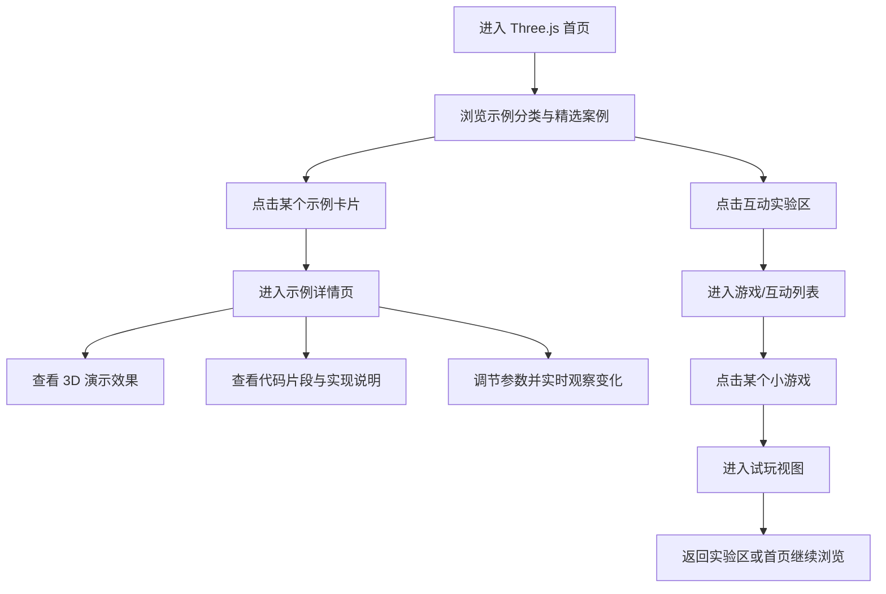

## 1. 产品概述
打造一个面向前端开发者、可视化爱好者和演示访客的 `Three.js 示例中心`，用于集中展示从基础到高级的 3D 示例代码、互动演示和轻量游戏案例。
- 解决当前项目中缺少系统化 3D/Three.js 教学展示入口的问题，让用户可以直接浏览、点击体验并查看对应代码结构。
- 该页面可作为项目里的 3D 能力展示专区，也可作为后续扩展 WebGL、着色器、小游戏实验场的统一入口。

## 2. 核心功能

### 2.1 功能模块
1. **Three.js 首页**：头部概览、能力说明、示例分级入口、精选案例推荐。
2. **示例详情页**：3D 画布、示例说明、代码片段、参数控制、知识点说明。
3. **互动实验区**：小游戏与高级交互示例，支持直接点击进入体验。

### 2.2 页面详情
| 页面名称 | 模块名称 | 功能说明 |
|-----------|-------------|---------------------|
| Three.js 首页 | Hero 展示区 | 展示页面主题、能力标签、进入示例和实验区入口，营造科技感和 3D 视觉氛围 |
| Three.js 首页 | 示例分级导航 | 将示例按基础、进阶、高级、实验、游戏分类展示，支持卡片点击跳转 |
| Three.js 首页 | 精选案例区 | 展示若干代表性案例，如旋转立方体、粒子宇宙、相机漫游、后期效果、物理小游戏 |
| Three.js 首页 | 学习路径区 | 告知用户从基础几何体、灯光、材质、纹理，到着色器、粒子、后处理、小游戏的推荐路径 |
| 示例详情页 | 3D 预览区 | 在页面中实时挂载当前示例，支持自适应尺寸、暂停/重置等操作 |
| 示例详情页 | 示例信息区 | 展示示例标题、分类、难度、知识点、适用场景 |
| 示例详情页 | 参数控制区 | 支持对旋转速度、灯光强度、粒子数量、相机位置等参数进行交互调整 |
| 示例详情页 | 代码展示区 | 展示核心示例代码片段、结构说明和实现思路，不要求完整 IDE，但需易读且可滚动查看 |
| 示例详情页 | 扩展说明区 | 展示常见优化建议、性能提示、开发要点和下一步学习推荐 |
| 互动实验区 | 游戏卡片区 | 展示多个轻量小游戏/互动作品，如躲避障碍、点击收集、镜头飞行、反应测试等 |
| 互动实验区 | 试玩容器 | 点击某个游戏后进入对应试玩视图，支持返回实验区列表 |
| 互动实验区 | 游戏说明区 | 展示玩法说明、控制方式、得分规则和实现亮点 |

## 3. 核心流程
用户进入 Three.js 首页后，先看到整体视觉引导和示例分类，再根据兴趣进入具体示例详情页或互动实验区；在示例详情页中可边看 3D 结果边查看代码与参数；在互动实验区中可点击体验不同小游戏并返回列表继续浏览。

## 4. 用户界面设计
### 4.1 设计风格
- 主色：深空蓝、霓虹青、紫蓝电光色
- 辅色：高亮青绿、暖金点缀、低饱和深灰蓝
- 按钮风格：圆角胶囊按钮 + 玻璃拟态描边 + 发光 hover
- 字体风格：标题采用偏未来科技感的粗体，正文保持清晰易读
- 布局风格：桌面优先，分区强、层级清晰，示例卡片和详情区域需要有明显的视觉节奏
- 图标/装饰风格：使用轨道线、网格线、粒子光晕、伪 HUD 面板等科技元素

### 4.2 页面设计概览
| 页面名称 | 模块名称 | UI 元素 |
|-----------|-------------|-------------|
| Three.js 首页 | Hero 展示区 | 大标题、动态背景、发光标签、主 CTA、次 CTA、漂浮装饰元素 |
| Three.js 首页 | 示例分级导航 | 分类标签、难度标记、卡片缩略预览、进入按钮 |
| Three.js 首页 | 精选案例区 | 大小错落卡片、案例简介、能力标签、交互动效 |
| Three.js 首页 | 学习路径区 | 时间线或步骤式布局、渐进式学习提示 |
| 示例详情页 | 3D 预览区 | 大尺寸 WebGL 容器、浮层操作按钮、加载与错误提示 |
| 示例详情页 | 参数控制区 | 滑块、切换按钮、色板、数值输入框 |
| 示例详情页 | 代码展示区 | 深色代码块、行高舒适、语法高亮风格、复制按钮 |
| 示例详情页 | 扩展说明区 | 知识点标签、实现拆解、性能提示卡片 |
| 互动实验区 | 游戏卡片区 | 横向或网格布局、封面插画、玩法标签、开始体验按钮 |
| 互动实验区 | 试玩容器 | 大面积体验舞台、分数/状态 HUD、重开与返回按钮 |

### 4.3 响应式设计
- 采用桌面优先设计，优先保证大屏和常规笔记本下的视觉完整性。
- 页面需支持常见笔记本宽度下的良好展示，卡片区和详情页在中等宽度时降级为双列或单列。
- 3D 画布必须自适应容器尺寸，窗口变化时自动 resize，避免拉伸和留白。
- 移动端不追求复杂排布，但需要保证基本可访问，支持纵向浏览与简单交互。

### 4.4 3D 场景指引
- 环境氛围：整体采用深色宇宙/实验室风格，突出发光材质与空间感。
- 灯光设置：基础示例用环境光 + 平行光；高级示例加入点光源、轮廓光和动态光效。
- 相机设计：基础示例支持轨道控制，高级示例支持镜头漫游或镜头插值动画。
- 构图重点：让每个示例都具备清晰主体，如几何体、粒子云、地形、飞线、角色或小游戏目标物。
- 交互与动画：支持旋转、悬浮、点击响应、参数变化、局部动画或循环动效。
- 后处理效果：高级示例可加入 Bloom、Noise、Depth、颜色偏移等增强质感。
- 资源与性能预算：尽量优先程序生成几何体和材质，减少超大贴图；高级示例要限制粒子数量和阴影开销，保证演示流畅。

## 5. 公众号教程联动
- **关联文章**：《Three.js 3D 示例中心全攻略：从基础几何体到交互场景与 3D 小游戏实战》
- **文章链接**：[https://mp.weixin.qq.com/s/J62wvjNYy79h5dFDRo1Vcw](https://mp.weixin.qq.com/s/J62wvjNYy79h5dFDRo1Vcw)
- **入口安排**：在 `/three-showcase` Hero 英雄区提供`📰 微信图文教程`直接跳转，同时同步至 `/wechat-featured` 公众号精选文章列表。
