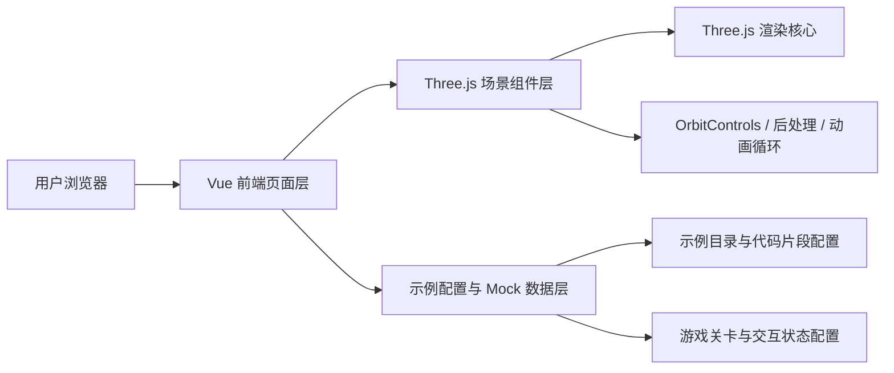
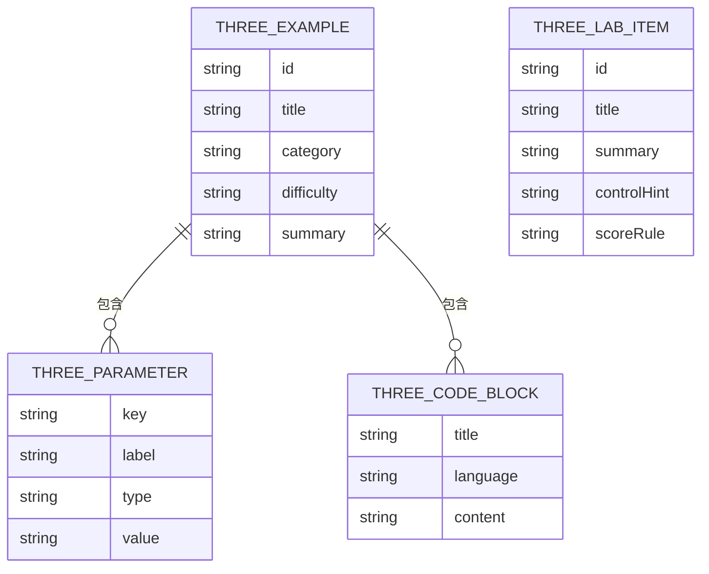

## 1. 架构设计


## 2. 技术说明
- 前端：Vue 3 + Vite + Vue Router + TypeScript
- 3D 渲染：three
- 页面样式：项目现有 SCSS 体系 + 局部科技感组件样式
- 代码高亮展示：优先使用现有轻量方式实现代码块展示，如必要时补充轻量高亮方案
- 数据来源：本地 mock 配置文件，按真实结构组织示例元数据、参数定义、代码片段和游戏配置
- 初始化方式：在现有项目中新增独立页面与组件，不新建独立子应用

## 3. 路由定义
| 路由 | 用途 |
|-------|---------|
| /three-showcase | Three.js 首页，展示分类、精选案例和学习路径 |
| /three-showcase/example/:id | 示例详情页，展示 3D 效果、代码、参数和说明 |
| /three-showcase/lab | 互动实验区，展示小游戏和高级互动案例 |

## 4. API 定义
本功能不依赖后端接口，所有数据通过本地 mock 和配置生成。

### 4.1 TypeScript 数据结构
```ts
interface ThreeExampleMeta {
  id: string
  title: string
  category: 'basic' | 'advanced' | 'shader' | 'game' | 'experiment'
  difficulty: 'easy' | 'medium' | 'hard'
  summary: string
  tags: string[]
  coverType: 'gradient' | 'canvas-preview'
}

interface ThreeExampleParameter {
  key: string
  label: string
  type: 'range' | 'toggle' | 'select' | 'color'
  min?: number
  max?: number
  step?: number
  value: string | number | boolean
}

interface ThreeExampleDetail extends ThreeExampleMeta {
  knowledgePoints: string[]
  sceneType: string
  codeBlocks: Array<{
    title: string
    language: string
    content: string
  }>
  parameters: ThreeExampleParameter[]
}

interface ThreeGameMeta {
  id: string
  title: string
  summary: string
  controlHint: string
  scoreRule: string
}
```

## 5. 服务端架构图
本功能不涉及服务端。

## 6. 数据模型
### 6.1 数据模型定义


### 6.2 数据定义说明
- 示例列表使用统一配置文件维护，支持首页、详情页和实验区复用。
- 每个示例使用独立场景组件，避免一个超大组件承载所有 3D 逻辑。
- 代码展示内容采用静态字符串配置，便于后续替换成真实源码读取或在线编辑模式。
- 参数控制采用声明式配置驱动，页面根据参数类型自动渲染滑块、按钮或选择器。

## 7. 前端模块拆分
| 模块 | 职责 |
|------|------|
| `src/views/threeShowcase/index.vue` | Three.js 首页与分类入口 |
| `src/views/threeShowcase/example.vue` | 示例详情页 |
| `src/views/threeShowcase/lab.vue` | 游戏与互动实验区 |
| `src/views/threeShowcase/data/examples.ts` | 示例与代码片段 mock 数据 |
| `src/views/threeShowcase/components/` | 卡片、参数面板、代码面板、场景容器等可复用组件 |
| `src/views/threeShowcase/scenes/` | 各类 Three.js 场景组件，如基础立方体、粒子宇宙、波浪地形、小游戏场景 |

## 8. 关键实现策略
- 使用独立的 `SceneCanvas` 封装 `renderer / scene / camera / resize / dispose` 生命周期，防止示例切换时资源泄漏。
- 基础示例优先覆盖几何体、材质、灯光、纹理、相机控制。
- 高级示例覆盖粒子、曲线、后处理、地形、着色器感效果或准游戏场景。
- 游戏示例优先使用轻量规则与简单状态机实现，避免引入复杂物理引擎导致接入成本过高。
- 详情页需支持参数变化实时反映到场景，使用响应式参数对象驱动动画和材质更新。
- 页面需提供容错状态，若 WebGL 初始化失败，则展示降级提示卡片。

## 9. 性能与可维护性
- 每个示例进入时再初始化渲染器，离开页面立即 `dispose` 几何体、材质和纹理。
- 控制粒子数、阴影和后处理数量，优先保证中端设备流畅演示。
- 场景组件保持单一职责，每个示例一个组件，便于后续继续追加更多案例。
- 所有示例元数据、参数和代码片段走配置化方案，新增案例时尽量只增配置和场景组件。

## 10. 公众号精选数据与教程联动
- **关联文章链接**：`https://mp.weixin.qq.com/s/J62wvjNYy79h5dFDRo1Vcw`
- **数据结构**：在 `src/ajson/wechat-featured-articles.json` 中配置 `slug: "threejs-showcase-guide"`，关联分类、摘要与外链。
- **页面视图**：`/three-showcase` 的 Hero 区域挂载 `openExternalUrl` 打开公众号教程，形成闭环体验。
