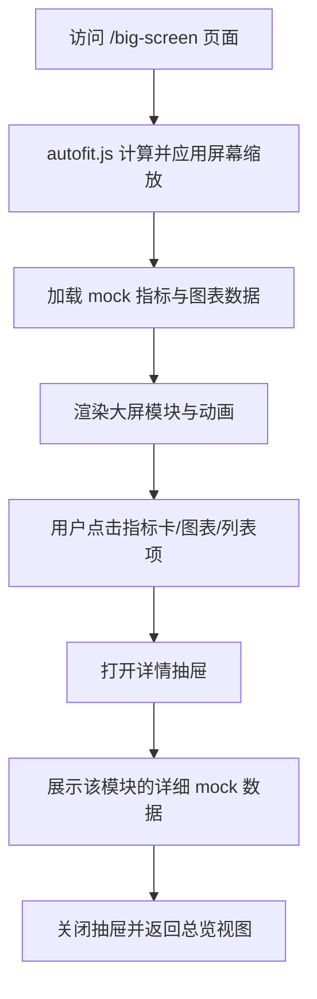

## 1. 产品概述
新建一个可直接访问的可视化大屏页面，基于 `vue-big-screen` 模板能力与 `autofit.js` 自适应缩放，展示一套“看起来像真实业务系统”的运营驾驶舱。
- 页面面向演示、汇报、展示场景，重点解决现有项目里缺少沉浸式大屏视图的问题。
- 通过 mock 生成真实结构化数据，确保视觉、交互、指标口径、点击查看细节都具备完整演示价值。

## 2. 核心功能

### 2.1 用户角色
本页面无需区分用户角色，默认所有访问者都可浏览和交互。

### 2.2 功能模块
1. **大屏主页**：顶部标题区、核心 KPI、地图/区域态势、趋势图表、告警列表、任务进度、实时流水。
2. **详情查看能力**：点击任意指标卡、图表卡、列表项后打开详情抽屉/弹层，查看更细粒度 mock 数据。

### 2.3 页面详情
| 页面名称 | 模块名称 | 功能说明 |
|-----------|-------------|---------------------|
| 大屏主页 | 顶部标题栏 | 展示系统标题、当前时间、运行状态、刷新状态与快捷说明 |
| 大屏主页 | 核心指标区 | 展示总交易额、告警总量、设备在线率、工单完成率等高亮指标卡 |
| 大屏主页 | 区域态势区 | 展示全国区域分布、重点省份排名、区域活跃度趋势 |
| 大屏主页 | 趋势分析区 | 展示 24 小时趋势、近 7 天对比、渠道构成、风险波动图等 |
| 大屏主页 | 告警与任务区 | 展示告警事件、待处理任务、巡检记录、值班状态 |
| 大屏主页 | 实时流水区 | 展示滚动 mock 数据流，模拟真实系统持续刷新效果 |
| 详情查看 | 详情抽屉 | 点击卡片或图表后展示明细数据、时间序列、占比、说明文字 |

## 3. 核心流程
用户进入 `/big-screen` 页面后，首先看到完整大屏概览；页面自动适配不同分辨率并渲染 mock 数据；用户点击某张指标卡、趋势图或列表项时，右侧弹出详情面板，展示对应明细和补充说明。

## 4. 用户界面设计
### 4.1 设计风格
- 主色：深海军蓝、霓虹蓝、青绿色、少量橙红预警色
- 按钮风格：圆角发光边框、轻玻璃拟态、按压与浮动 hover 效果
- 字体与字号：标题偏科技感粗体，正文字体清晰克制，数值采用更高对比的等宽感字体
- 布局风格：典型驾驶舱三列分区 + 中央重点区域，强调强视觉层次和聚焦阅读路径
- 图标/装饰建议：使用线性科技图标、微发光描边、动态光栅背景、扫描线与细颗粒噪点

### 4.2 页面设计概览
| 页面名称 | 模块名称 | UI 元素 |
|-----------|-------------|-------------|
| 大屏主页 | 顶部标题栏 | 高对比标题、时间状态块、细线分隔、弱动效扫描光 |
| 大屏主页 | KPI 指标卡 | 发光数字、趋势箭头、环形光晕、点击态边框强化 |
| 大屏主页 | 图表模块 | 深色容器、标题标签、角标装饰、点击后高亮选中态 |
| 大屏主页 | 列表模块 | 滚动列表、风险色状态点、悬停高亮、信息层级清晰 |
| 详情查看 | 详情抽屉 | 半透明深色抽屉、标题摘要、明细表格、扩展图表和事件说明 |

### 4.3 响应式
- 默认采用桌面优先的大屏设计，以 1920x1080 作为基准画布
- 使用 `autofit.js` 做整体缩放自适应，保证 1366、1600、1920、2K 屏下比例稳定
- 在较窄窗口下保留可滚动回退方案，避免内容裁切无法查看
- 所有图表和卡片需支持容器尺寸变化后的重新布局

### 4.4 大屏场景指引
- 背景氛围：深色数字驾驶舱，带轻微网格、扫描光和边缘辉光
- 光效节奏：顶部与中心区域更亮，左右两侧模块稍弱，形成视觉中心
- 构图策略：中间聚焦区域展示最重要态势，两侧承载辅助监控信息
- 交互动画：模块入场、数字滚动、列表滚动、图表 hover、抽屉开合动画
- 性能约束：优先 CSS 和 ECharts 原生动画，避免重型 3D 渲染
