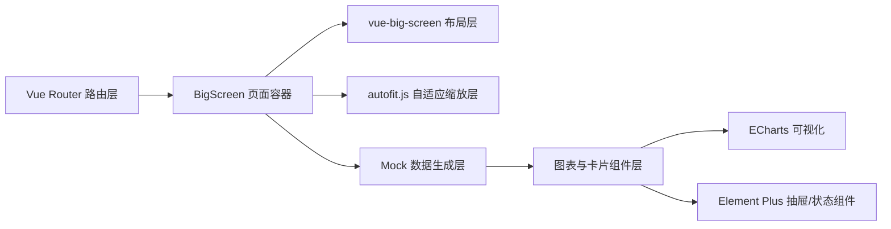
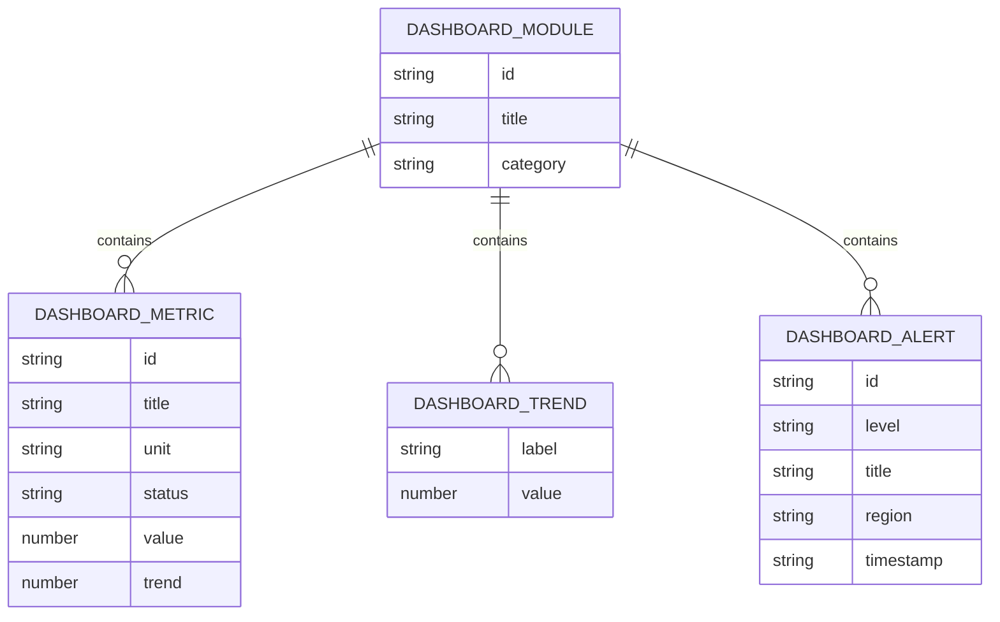

## 1. 架构设计


## 2. 技术说明
- 前端：Vue 3.5 + TypeScript + Vite + Vue Router
- UI：Element Plus + 项目现有 SCSS 体系
- 大屏布局：`vue-big-screen`
- 自适应：`autofit.js`
- 图表：ECharts
- 数据：本地 mock 生成模块，按真实业务指标结构组织
- 初始化方式：在现有项目内新增页面与组件，不重新初始化工程

## 3. 路由定义
| 路由 | 用途 |
|-------|---------|
| /big-screen | 大屏驾驶舱主页面，展示总览和各类图表模块 |

## 4. API 定义
本次不新增后端接口，全部使用前端本地 mock 数据模拟真实返回结构。

### 4.1 TypeScript 数据类型
```ts
interface BigScreenMetric {
  id: string
  title: string
  value: number | string
  unit: string
  trend: number
  status: 'up' | 'down' | 'stable'
}

interface BigScreenTrendPoint {
  label: string
  value: number
}

interface BigScreenAlertItem {
  id: string
  level: 'critical' | 'warning' | 'notice'
  title: string
  region: string
  timestamp: string
  detail: string
}

interface BigScreenDetailPayload {
  id: string
  title: string
  summary: string
  metrics: BigScreenMetric[]
  timeline: BigScreenTrendPoint[]
  records: Array<Record<string, string | number>>
}
```

### 4.2 Mock 数据规范
- 指标命名采用真实业务口径，如交易额、活跃设备、告警数、工单完成率
- 趋势数据按小时、天、区域维度生成
- 明细数据需支持点击卡片后展示更细项内容
- 所有 mock 数据集中放入独立模块，避免写死在组件模板内

## 5. 服务端架构图
本次不涉及后端服务，不创建服务端架构。

## 6. 数据模型
### 6.1 数据模型定义


### 6.2 模块划分
- `src/views/bigScreen/index.vue`：页面入口与整体布局
- `src/views/bigScreen/components/`：大屏卡片、图表容器、详情抽屉等组件
- `src/views/bigScreen/mock/`：mock 数据生成与转换逻辑
- `src/views/bigScreen/composables/`：自适应、时间刷新、详情状态管理
- `src/views/bigScreen/css/`：页面专属样式

## 7. 实现约束
- 使用 `<script setup lang="ts">`
- 核心页面与高频组件不使用动态导入
- 每个组件尽量控制在单一职责内，超过 300 行及时拆分
- 所有点击查看动作必须真实可用，不做假按钮
- 页面必须支持窗口 resize 后的重新适配
- mock 数据虽然本地生成，但展示形式必须贴近真实业务监控系统
